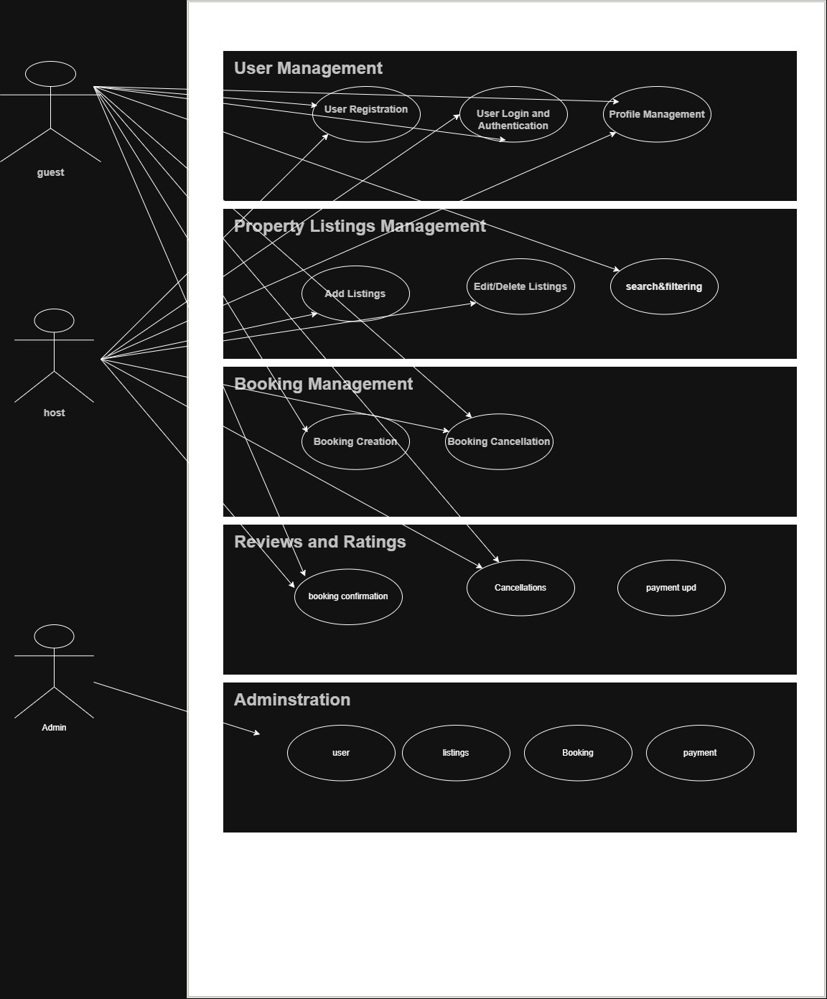

---

## 📌 Objective

Create a use case diagram that visualizes the interactions between users (guests, hosts, and admins) and the Airbnb Clone system for key functionalities including:

- User Registration and Authentication  
- Property Listings Management  
- Property Booking and Cancellation  
- Payment Integration  
- Reviews and Ratings  
- Admin Dashboard Operations  

---

## 🧩 Use Case Diagram

The image below (`arch.jpg`) located in the `use-case-diagram/` directory illustrates the interactions between system actors and functionalities:

**Actors:**

- Guest  
- Host  
- Admin  

**Use Cases:**

- Sign up / Log in  
- Search for properties  
- Book a property  
- Cancel booking  
- Make a payment  
- Add/Edit/Delete property (Host only)  
- Leave a review / Respond to review  
- Receive notifications  
- Manage users, listings, and payments (Admin only)  

---

## 🛠️ Backend Functional Requirements

### 🔑 Core Functionalities

- **User Management** with secure login (JWT & OAuth)
- **Property Management** by hosts
- **Advanced Search and Filters**
- **Booking System** with date validation
- **Payment Gateway Integration** (Stripe/PayPal)
- **Ratings & Reviews** system
- **Notification System** (Email/In-app)
- **Admin Dashboard** for moderation

### ⚙️ Technical Stack (Suggested)

- **Backend:** Node.js / Django / Flask  
- **Database:** PostgreSQL / MySQL  
- **Authentication:** JWT, OAuth2  
- **Payments:** Stripe, PayPal  

---

